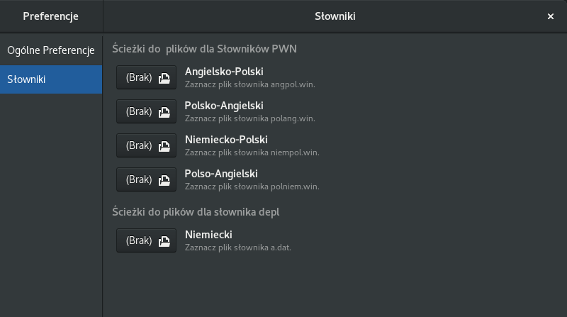
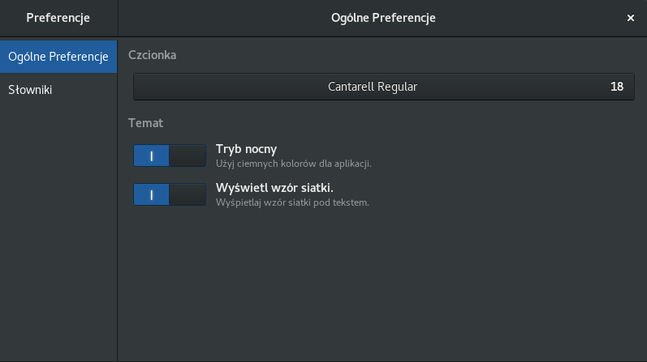

# Project: Gydict


## Program Gydict
**Gydict** jest aplikacją słownikową, która pracuje z różnymi słownikami multimedialnymi (darmowymi i komercyjnymi) dostępnymi tylko pod systemem Windows. Aplikacja pozwala korzystać z tych słowników pod systemem Linux.

### Wymagania
Aby skompilować program, będzie potrzebna wersja deweloperska biblioteki **gtk+** w wersji 3.22.

### Jak skompilować?
Należy wykonać następujące polecenia:
 ```
 meson builddir
 ninja -C builddir
 sudo ninja -C builddir install
 ```
### Co Gydict oferuje?
*  reaguje na schowek;
*  umożliwia  ustawienia własnych ścieżek do słowników oraz własnych fontów;
*  program posiada historię używanych słów (każdy słownik swoją własną);
*  możliwość wydrukowania szukanego słowa.

## Jakie słowniki obsługuje Gydict?

### PWN Oxford 2006/2007
Moduł obsługuje słowniki angielsko-polski oraz polsko-angielski. Niezbędne jest posiadania dwóch plików z już zainstalowanej aplikacji pod Windows. Są to pliki '**angpol.win**' oraz '**polang.win**'.

### Wielki mutlimedialny słownik Niemiecko-Polski i Polsko-Niemiecki
Od wersji 0.3.0 Gydict obsługuje kolejny słownik PWN. Niezbędne jest posiadania dwóch plików z już zainstalowanej aplikacji pod Windows. Są to pliki '**niempol.win**' oraz '**polniem.win.**'.

### Słownik DEPL
Jest to darmowy słownik niemiecko-polski. Aby słownik działał należy wejść na stronę www.depl.pl i pobrać aktualną bazę wyrazów lub w konsoli wpisać polecenie: wget http://www.depl.pl/wyrazy.zip
Z archiwum **wyrazy.zip** bierzemy plik **a.dat**.

## Konfiguracja programu Gydict

### Konfiguracja ścieżek do słowników
Przy pierwszym uruchomieniu należy ustawić ścieżki do słowników. Należy otworzyć okno preferencji (wybiera się je z menu aplikacji) i przejść do zakładki **Słowniki**, i tam odpowiednio skorzystać z odpowiedniego przycisku.



### Konfiguracja czcionki
Aby zmienić domyślną czcionkę, należy uruchomić program **Gydict**, potem wejść w menu aplikacji i wybrać **Preferencje**, i następnie przejść do zakładki **Ustawienia domyślne**, i następnie wybrać odpowiednią czcionkę.

### Pozostała konfiguracja
Ponadto można wybrać styl (ciemny lub jasny) oraz włączyć wyświetlenia siatki w kontrolce tekstowej.



## Kontakt
|             |                          |
| :----:      | :----:                   |
| Author      | Jakub Czartek            |
| Email       | kuba@linux.pl            |
| Home Page   | http://jczartek.github.io/gydict |
| License     | GNU General Public License, version 2 (http://www.gnu.org/licenses/old-licenses/gpl-2.0.html) |

