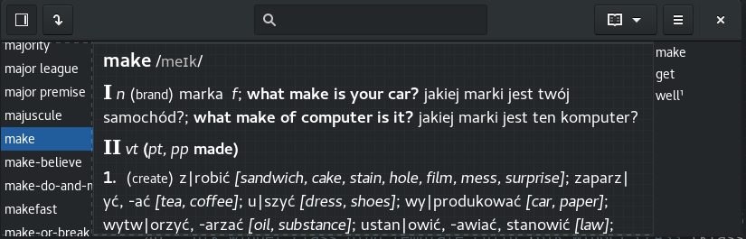
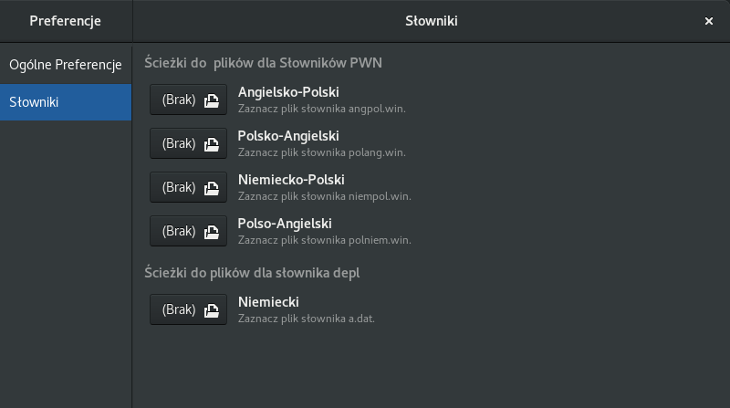
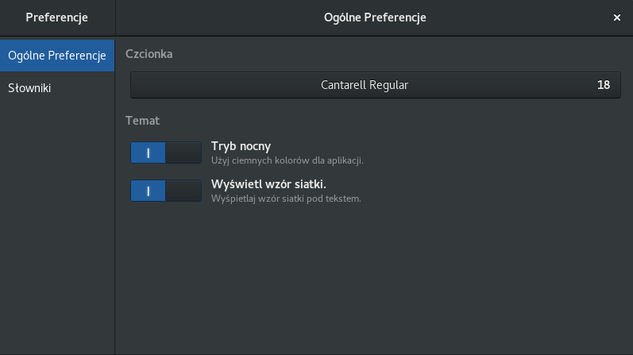

# Project: Gydict



## Program Gydict
**Gydict** is a dictionary application that works with various multimedia version of dictionaries (free and commercial) which are only available under Window. The program allows you to use those dictionaries under Linux.

### Requirements
To compile the program, you need to have the library Gtk+ in version 3.22.

### How to compile
Gydict is built using meson

```
 ./autogen
 make
 make install
 ```
 or using autotools
 ```
 meson builddir
 ninja -C builddir
 sudo ninja -C builddir install
 ```
### What does Gydict offer?
*  reacts on the system clipboard;
*  allows you to set own paths to dictionaries and own fonts;
*  allows you to add a word to the history of dictionary
*  prints the definition of the current displayed word.

## What dictionaries can use with Gydict?

### PWN Oxford 2006/07
The program serves English-Polish and Polish-English PWN Oxford dictionaries. It's neccesary to possess two files which are already installed in Window application. These files are: '**angpol.win**' and '**polang.win**'.

### Great multimedia German-Polish and Polish-German
Since version 0.3.0 Gydict has served another PWN dictionary. As it was written above you need two files also: '**niempol.win**' and '**polniem.win**'.

### DEPL Dictionary
Depl is free German-Polish dictionary. To get it, you need to go to www.depl.pl and download current dictionary words base or you put following command in your shell:
```
wget http://www.depl.pl/wyrazy.zip
```
Next you need to extract the '**a.dat**' file from '**wyrazy.zip**' archive.

## Configuration of Gydict

### Configuration of paths
To set paths to dictionaries, you need to open the preference window and look up the dictionaries tab and use appropriate buttons.



### Configuration of fonts
To set fonts, you need to open the preference window and look up the tab named 'General Preference' and use the first button.

### Other configuration
Moreover you can change the style of application and display the grid pattern.



## Contakt
|             |                          |
| :----:      | :----:                   |
| Author      | Jakub Czartek            |
| Email       | kuba@linux.pl            |
| Home Page   | http://jczartek.github.io/gydict |
| License     | GNU General Public License, version 2 (http://www.gnu.org/licenses/old-licenses/gpl-2.0.html) |

