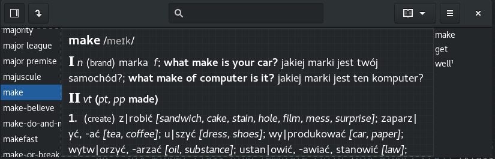

# Project: Gydict



## Program Gydict
**Gydict** is a dictionary application that works with various multimedia version of dictionaries (free and commercial) which are provided as plugins.

### Requirements
To compile the program, you need to have the library Gtk+ in version 3.22.

### How to compile
Gydict is built using meson
 ```
 meson builddir
 ninja -C builddir
 sudo ninja -C builddir install
 ```
### What does Gydict offer?
*  reacts on the system clipboard;
*  prints the definition of the current displayed word.

## What dictionaries can use with Gydict?

__TODO__

## Contakt
|             |                          |
| :----:      | :----:                   |
| Author      | Jakub Czartek            |
| Email       | kuba@linux.pl            |
| License     | GNU General Public License, version 2 (http://www.gnu.org/licenses/old-licenses/gpl-2.0.html) |

